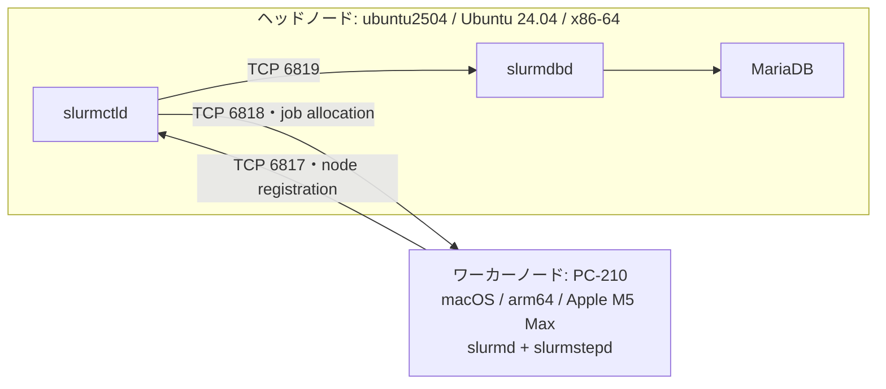

# はじめに

Slurm の[公式Platformsページ](https://slurm.schedmd.com/platforms.html)には、
Linux は x86_64 を含む複数アーキテクチャでテストされている一方、macOS は
過去に動作していたものの現在は動作しない、と記載されています。

そこで、Apple M5 Max 搭載MacをSlurmクラスタの計算ノードにするため、
macOS上で `slurmd` をビルド・起動し、Ubuntu上のコントローラからbatch jobと
Metal GPU jobを実行するPoCを行いました。

この記事では、成功した結果だけでなく、途中で遭遇したコンパイルエラー、
daemon起動エラー、job実行エラー、修正内容、そしてまだ確認できていない事項も
残します。

> **重要な検証範囲**
>
> macOSで移植・運用検証したdaemonは **`slurmd` 側のみ**です。
> `slurmctld` と `slurmdbd` は x86-64版Ubuntu 24.04のヘッドノードで動かして
> います。macOS上で `slurmctld` / `slurmdbd` が動くことを検証した記事では
> ありません。

## TL;DR

- 作業フォルダ名は `slurm.26-05` ですが、ソース、configureログ、生成物、
  インストール済みbinaryのEvidenceはすべて **Slurm 26.11.0-0rc1** を示しました。
- ヘッドノードは x86-64 / Ubuntu 24.04で、`slurmctld`、`slurmdbd`、MariaDBを
  実行しました。
- ワーカーノードは arm64 / macOS / Apple M5 Maxで、`slurmd` と、そのchildで
  ある `slurmstepd` のjob実行経路を検証しました。
- `pipe2`、`accept4`、POSIX timer、CPU bitmap、SACK、pthread、`/proc`、
  Mach-O plugin symbolなど、多数のLinux/ELF依存を修正しました。
- 61項目の試験候補のうち、49件が`PASS`、`PASS_STAGING`は0件、5件が
  `PASS_EXPECTED_UNSUPPORTED`、1件が
  `PASS_TLS_RUNTIME_REVISED_CERTGEN / CLEANUP_COMPLETE`
  まで到達しました。`srun --pty`、signal、process tree、
  daemon/controller再起動、sleep/wake、24時間soak、node hook、Apple GPU GRES、
  mixed-architecture、configless、IPv6を実機で確認しました。
- 24時間soakは288/288 jobが`COMPLETED 0:0`、FDは全sampleで13、threadは11、
  RSSの先頭・末尾12 sample平均差は553 KiBでした。
- Apple GPU GRESは排他スケジュール、正常終了・cancel・timeout・SIGSEGV後の再利用、
  accounting、30回反復、数値correctnessを確認しました。ただし`File=/dev/null`は
  台数管理用placeholderであり、Metal deviceを隔離しません。
- macOSではcgroupによるCPU・memory・device強制隔離がありません。実測でも
  `--mem=256M`のjobが約1 GiBをtouchでき、peak RSSは1,050,032 KiBでした。SMD-303では
  process、task、deviceのcgroup候補が欠落plugin/context名を明示して非0終了し、
  no-op起動しないことを確認しました。
- `jobacct_gather/none`では、実際にCPU 2.029384秒、RSS 133,600 KiB、read/write各32 MiBを
  消費したJob 675でも終了後のCPU値は0、RSS/VM/I/O usageは空でした。live `sstat AveCPU`の
  巨大値は未取得sentinelの表示であり、利用量として扱えません。
- core specializationは現行構成では`--core-spec=1`が明示的にignoreされ、CPU frequency要求は
  step metadataへ残るだけでした。SMD-305のJobs 680〜682は全件完了しましたが、core isolationや
  物理周波数制御が成立したことを意味しません。
- SMD-407のTLS切替ではMac TLS daemonのcontroller登録後、Mac client
  `scontrol ping`はDarwinの`/dev/fd/N` direct-exec非互換でhandshake前に失敗しました。最初の
  `/bin/sh /dev/fd/N`修正はclient-onlyでは一度成功したものの、daemon gateで`/dev/fd/6: Bad file
  descriptor`を再現しました。`run_command()`がexec前にFD 3以上を閉じるため、この成功は非決定的な
  false positiveです。不安定候補は両hostで旧版へrollbackしました。その後、組み込みscriptを
  `/bin/sh -c`へ渡す再修正版を両hostへbackup付きで再導入し、installed pathでMac 10回・Linux 5回の
  client初期化を連続PASSしました。さらにUbuntu production stackを一時TLS化し、Mac直接clientで平文拒否と
  TLS controller UPを5/5回確認しました。続くno-job診断ではMac `slurmd`をTLSでcontrollerへ登録し、
  `PC-210=IDLE`を確認後、両hostを`tls/none`へ復旧しました。さらにTLS下でCPU batch Job 634、direct
  `srun` Job 635、Apple GPU Job 636、arm64/x86-64 mixed Job 637を実行し、全Job/stepが
  `COMPLETED 0:0`、GPUのGRES/MLX、平文client拒否、未信頼CA拒否、両hostの`tls/none`復旧を確認しました。
  TLS artifact/stateはroot-only archiveへ保全後にactive pathから削除し、最終`tls/none` Jobs 638/639も
  `COMPLETED 0:0`でした。archive内試験鍵は再利用せず、将来のTLS再有効化時は新規発行が必要です。
  動的node、power control、version upgradeも前提不足です。
- 結論は「Linuxと同等のproduction-ready」ではなく、**制約を明示すればmacOSを
  Slurm compute nodeとして広範囲に動かせることを実証したPoC**です。

## リポジトリと再現用snapshot

- 公開フォーク: [kazuharu2022/slurm-26.11.0-RC](https://github.com/kazuharu2022/slurm-26.11.0-RC)
- SchedMD upstream: [SchedMD/slurm](https://github.com/SchedMD/slurm)
- 公開branch: `master`
- 記事初版・Evidence公開時のcommit: `1e20bbab8b88a20446ea28b5418ed6a9013a15a7`

2026-09-14に`git rev-parse HEAD`と`git ls-remote --symref origin HEAD
refs/heads/master`を実行し、local HEADと公開`origin/master`が同じcommitであることを
確認しました。再現時はbranch先端ではなくcommitを固定します。

```bash
git clone https://github.com/kazuharu2022/slurm-26.11.0-RC.git
cd slurm-26.11.0-RC
git checkout 1e20bbab8b88a20446ea28b5418ed6a9013a15a7
git remote add upstream https://github.com/SchedMD/slurm.git
```

ただし、61項目は複数日にわたるdirtyな開発treeと段階的なstaging artifactで検証しました。
この公開snapshotに記事とEvidenceは含まれますが、全途中状態をclean checkoutから一括再現した
証明ではありません。現在の正確なbuild条件、起動前check、launchd手順はrepository直下の
[`README.md`](../README.md)へ集約しました。SMD-102の1 file修正は固定HEADからの
clean-source buildとUbuntu分離buildまで再現しましたが、移植patch series全体のclean reproduction、
広範なLinux runtime regression、commit provenanceはMissing Evidenceとして残しています。

## クラスタ構成と検証範囲



| ノード | OS / architecture | 今回の役割 | macOS移植の検証対象 |
|---|---|---|---|
| `ubuntu2504` | Ubuntu 24.04 / x86-64 | `slurmctld`, `slurmdbd`, MariaDB | いいえ |
| `PC-210` | macOS 26.5.1 / arm64 | `slurmd`, `slurmstepd`, Metal GPU | **はい** |

macOS上で実行した `sinfo`、`squeue`、`sbatch`、`scancel`、`sacct` は、
`slurmd` の登録・job実行・accountingを観測するためのclient commandです。
client側の動作結果も記録しますが、cluster control daemonをmacOSへ移植した
という意味ではありません。

ヘッドノードについて保存されているログから、次を直接確認できました。

```text
slurmctld version 26.11.0-0rc1 started on cluster cluster
slurmdbd version 26.11.0-0rc1 started
MySQL server version is: 10.11.14-MariaDB-0ubuntu0.24.04.1
```

Ubuntu側でも`hostname`、`uname -m`、node情報、systemd状態を追加取得し、
`ubuntu2504`、`x86_64`、Ubuntu 24.04、Slurm 26.11.0-0rc1を確認しました。
後半のSMD-402以降では、同じUbuntu hostをcontroller/databaseだけでなく
x86-64 workerとしても兼用しています。

なお、Ubuntu 24.04はSlurm公式Platformsページにsupported distributionとして
掲載されています。このため、Linuxヘッドノードは比較的標準的な構成とし、
非公式状態にあるmacOSの `slurmd` 側を調査対象に絞りました。

## 記事内のEvidence区分

単にコンパイルできたことと、実運用経路で正しく動いたことを区別します。

| 状態 | 意味 |
|---|---|
| **確認済み** | 今回の実機出力または保存済みログで成功を確認した |
| **部分確認** | 特定の経路では成功したが、網羅性・長時間安定性・回帰までは未確認 |
| **未確認** | ソースまたは設定は用意したが、対象経路を実行していない |
| **対象外** | PoC の方針として機能を無効化した、または実装していない |

## Research Question

Slurm公式は`slurmd`を、compute node上のtaskを受け取り、起動・監視し、要求に応じて
終了させるdaemonと定義しています。本検証の問いは次のとおりです。

> Linux向け実装を前提とするSlurm 26.11.0-0rc1をApple Silicon macOSへ移植したとき、
> task lifecycle、障害復旧、user/process/resource境界、Apple Metal GPU、異種architecture間通信を、
> 実jobとaccounting Evidenceでどこまで成立させられるか。

単純な`hostname`成功だけでは答えになりません。`slurmd`の責務にはtaskの起動だけでなく、
I/O、signal、timeout、子process回収、再登録、resource解放が含まれるためです。

## 仮説と反証条件

仮説は「OS依存箇所をportableなAPIへ分離すれば、scheduler上の主要lifecycleはmacOSでも
成立する。ただしLinux cgroup依存の強制隔離は同等にならない」としました。

この仮説を支持する条件は、UID/GIDを揃えた実userのjobが期待どおり完了または失敗し、
`sacct`のstate/exit codeと一致し、終了後にqueue・allocation・対象processが残らないことです。
反証条件にはdaemon crash、別userでの実行、cancel後のprocess残留、resourceの永久占有、
nodeの復旧不能、または成功と表示しながら制約が実際には適用されないsilent failureを置きました。

## 検証設計

試験を次の6群、計61項目に分けました。

| 試験群 | ID | 主な対象 |
|---|---|---|
| P0 task/daemon | SMD-001〜016 | `srun`、PTY、I/O、signal、timeout、再起動、通信断、sleep/wake、24時間soak |
| P1 identity/resource | SMD-101〜113 | user、cwd、environment、umask、multi-task/step、CPU、process、ulimit、memory、ENOSPC |
| P1 hook/plugin | SMD-120〜127 | Prolog/Epilog、SPANK、HealthCheck、plugin load、log rotation |
| P1 Apple GPU | SMD-201〜208 | GRES排他・解放・accounting、Metal実行、反復安定性、数値correctness |
| negative test | SMD-301〜306 | affinity、cgroup、jobacct、`/proc`非存在などmacOS固有制約 |
| P2 integration | SMD-401〜410 | PMI2、異種architecture、configless、IPv6、TLS、dynamic node等 |

各runtime試験では、stdout/stderrだけでなく、`sacct`、`squeue`、`scontrol show node`、
PID/PGID、関連process、設定・binary hashを保存しました。途中のmarkerや一部成功だけでは
PASSにせず、最終`IDLE`、allocation 0、queue空、process残留0までを完了条件にしました。

:::note info
本記事の`PASS_STAGING`は、修正版をstagingした経路で成功したことを意味します。
production常設済みを意味する`PASS`とは区別しています。2026-09-23の再検証で、当時
`PASS_STAGING`だった9項目は全てproduction構成の`PASS`へ昇格しました。
:::

## フォルダ名は26.05だが、実体は26.11.0-0rc1

当初、作業フォルダを `slurm.26-05` として開始しました。しかし、フォルダ名は
versionのEvidenceにはなりません。現在のソースとbinaryを再確認しました。

### 検証時と公開時のGit revision

```bash
git rev-parse HEAD
git describe --tags --always --dirty
```

```text
a77367bb482ab2f626fb5981d1349159e5ae8740
slurm-25-05-0-1-8823-ga77367bb48-dirty
```

これは主要なmacOS検証を始めた時点の開発treeです。`git describe` の
`slurm-25-05-0-1`は最も近い到達可能なtagを起点にした表記で、
package versionそのものではありません。このcheckoutは、そのtagから8823
commit進んだdirtyな開発treeです。

記事とEvidenceを整理した2026-09-14時点では、local HEADと公開`origin/master`は
`1e20bbab8b88a20446ea28b5418ed6a9013a15a7`で一致しています。検証時のdirty treeと
公開snapshotを同一視せず、前者は実験履歴、後者は読者が取得できる参照点として扱います。

### 生成されたversion header

```bash
grep -E 'PACKAGE_VERSION|SLURM_VERSION_STRING' config.h
```

```text
#define PACKAGE_VERSION "26.11"
#define SLURM_VERSION_STRING "26.11.0-0rc1"
```

### configure log

`config.log` の冒頭には次が保存されています。

```text
It was created by slurm configure 26.11
```

configureのprefixも `/opt/slurm/26.11.0` です。

### インストール済みbinary

```bash
/opt/slurm/26.11.0/sbin/slurmd -V
/opt/slurm/26.11.0/bin/sinfo --version
```

```text
slurm 26.11.0-0rc1
slurm 26.11.0-0rc1
```

以上の4系統のEvidenceから、本記事の対象を **Slurm 26.11.0-0rc1** と確定します。
「26.05」という名前は作業開始時のフォルダ名・初期資料名に残っているだけで、
検証対象versionを表していません。

また、古い `/opt/slurm/26.05` を参照するlaunchd用draftは、そのまま現在環境へ
導入できません。この点も未確認事項として後述します。

## 検証環境

### ヘッドノード

| 項目 | 値 |
|---|---|
| Host | `ubuntu2504` |
| OS | Ubuntu 24.04 |
| Architecture | x86-64 |
| Role | `slurmctld`, `slurmdbd`, MariaDB |
| Slurm daemon version | 26.11.0-0rc1 |
| macOS移植検証 | 対象外 |

### macOSワーカーノード

2026-09-09 にローカルで再確認した値です。

| 項目 | 値 |
|---|---|
| Host | `PC-210.local` |
| Hardware | MacBook Pro / Apple M5 Max |
| CPU architecture | `arm64` |
| CPU | 18 cores |
| Memory | 128 GB unified memory |
| macOS | 26.5.1 (Build 25F80) |
| Darwin | 25.5.0 |
| Compiler | Apple Clang 21.0.0 |
| Linker | Apple ld64, project `ld-1267` |
| Slurm | 26.11.0-0rc1 |
| hwloc | 2.14.0 |
| json-c | 0.19 |
| libjwt | 2.1.3 |
| Python | 3.14.6 |
| uv | 0.12.2 |
| MLX | 0.32.2 |

当初の方針書には macOS 26.5.2 と記載されていましたが、現在の `sw_vers` は
26.5.1でした。OS更新前後での再検証は行っていません。

## configure条件

現在の `config.log` に記録された configure は次のとおり。

```bash
./configure \
  --prefix=/opt/slurm/26.11.0 \
  --sysconfdir=/opt/slurm/26.11.0/etc \
  --with-jwt=/opt/slurm-deps/libjwt-2.1.3 \
  --with-hwloc=/opt/homebrew/opt/hwloc \
  --with-json=/opt/homebrew/opt/json-c \
  --without-munge \
  --without-readline \
  --disable-cgroupv2 \
  --disable-x11 \
  --disable-sview \
  --disable-slurmrestd
```

`config.log` は `configure: exit 0` を記録しているため configure は確認済み。
`--with-json` は `serializer/json` を生成するために追加した。MUNGE は使用せず、
`auth/slurm` と `cred/slurm` を使用する。

実際には`CPPFLAGS`、`LDFLAGS`、`PKG_CONFIG_PATH`も指定しています。copy可能な完全版、
dependency path、`DESTDIR` staging、worker設定、launchd起動前後のcheckは
[`README.md`](../README.md#macosで検証したconfigure条件)に掲載しました。

## 発生した問題と修正経過

### Apple ld64 と GNU ld オプションの非互換

症状:

- `-Wl,-rpath=<path>`、`--no-as-needed`、`-z noexecstack`、
  `--format=binary` など、GNU ld 前提の処理が Apple ld64 では成立しない。
- `.txt` リソースを ELF オブジェクトへ変換する既存規則を Mach-O へそのまま
  適用できない。

修正:

- Darwin 用の Automake conditional `DARWIN_BUILD` を追加。
- rpath を Apple ld64 で受理される `-Wl,-rpath,<path>` 形式へ変更。
- Darwin では `--no-as-needed` を付けない。
- Darwin では `.incbin` を使う assembler 入力から Mach-O relocatable object
  を生成し、既存の `__binary_*_start/end` シンボル契約を維持。
- 各コマンド配下の生成済み `Makefile.in` へ同等の規則を反映。

主な対象:

- `configure.ac`, `configure`, `auxdir/slurm.m4`
- `make_ref.include`
- `src/slurmd/slurmd/Makefile.am`, `Makefile.in`
- `src/{sacct,sacctmgr,sackd,scontrol,scrontab,scrun,sinfo,slurmctld,slurmrestd,sprio,squeue,swait}/Makefile.in`
- `src/plugins/certgen/script/Makefile.in`

状態: **部分確認**。macOS 上の実ビルドとコマンド生成は成立した。一方、用意
した `testsuite/macos_build_compatibility.sh` の全モード実行証跡、および
GNU/Linux 上での同一基準による回帰確認は残っていない。

### `cpu_set_t` と Linux CPU affinity API

症状:

```text
error: unknown type name 'cpu_set_t'
```

原因:

macOS は Linux の `cpu_set_t`、`CPU_*_S`、`sched_getaffinity()`、
`sched_setaffinity()` と互換の API を提供しない。

修正:

- `src/common/xsched.h` に、Slurm 内部 bitmap 用の `cpu_set_t` と
  `CPU_ALLOC_SIZE` / `CPU_ZERO_S` / `CPU_SET_S` / `CPU_CLR_S` /
  `CPU_ISSET_S` / `CPU_COUNT_S` 互換処理を追加。
- bitmap と文字列の相互変換を macOS でも有効化。
- `xgetaffinity()` 相当は `_SC_NPROCESSORS_ONLN` で取得した全 online CPU を
  使用可能として返す。
- `xsetaffinity()` 相当は `ENOTSUP` を返す。

状態: **部分確認**。18 CPU の検出と Slurm の CPU リソース割当は動作したが、
OS レベルの CPU pinning は実装していない。P-core/E-core の区別、NUMA、
特定 CPU への拘束も未確認または対象外である。

### `pipe2`、`accept4`、`SOCK_CLOEXEC`、`eventfd`

症状:

```text
eio.c: error: call to undeclared function 'pipe2'
```

および、Linux 固有の `accept4()`、`SOCK_CLOEXEC`、`eventfd()` 依存。

修正:

- `src/common/fd.c` / `fd.h` に次の共通 wrapper を追加。
  - `fd_pipe_close_on_exec()`
  - `fd_event_create()`
  - `fd_socket_close_on_exec()`
  - `fd_accept_close_on_exec()`
- macOS では `pipe()` / `socket()` / `accept()` の後に `fcntl()` で
  `FD_CLOEXEC` と必要な `O_NONBLOCK` を設定。
- Linux では既存の `pipe2()` / `eventfd()` / `accept4()` を維持。
- common、conmgr、slurmstepd、srun、salloc、scrun、PMI2、PMIx、cgroup v1
  などの呼び出しを wrapper へ置換。

状態: **部分確認**。通常の slurmd 通信、batch job、signal、scancel 経路は
動作した。ただし macOS の `pipe/socket/accept` から `fcntl` までの処理は
Linux の atomic な CLOEXEC 設定と完全には同等でなく、並行 fork/exec 時の
descriptor leak 競合は未評価である。MPI/PMIx、salloc、scrun の個別実行も
未確認。

### POSIX realtime timer 非対応

症状:

```text
error: unknown type name 'timer_t'
error: call to undeclared function 'timer_create'
error: call to undeclared function 'timer_settime'
error: call to undeclared function 'timer_delete'
```

修正:

- configure で `timer_create()` を検出し、`HAVE_TIMER_CREATE` を定義。
- 非対応環境では `pthread_cond_timedwait()` を使う専用 timer thread で
  conmgr の遅延処理を起床させる。

状態: **部分確認**。slurmd 起動・登録・通常ジョブ経路は進行したため基本経路
は通っている。一方、多数の遅延処理、deadline 更新競合、reconfigure、長時間
運転、終了処理を含む stress test は未実施。

### socket listener 判定

症状:

```text
fatal: init_sack_conmgr: [fd:6] conmgr rejected socket: Protocol not available
```

原因:

Darwin では `SO_ACCEPTCONN` が定義されていても `getsockopt()` が
`ENOPROTOOPT` を返す経路がある。

修正:

- `src/conmgr/con.c` で listener 状態に「不明」を追加。
- macOS の `ENOPROTOOPT` は、呼び出し側が listener API を選択済みであること
  を前提に受理。

状態: **確認済み**。修正後に `auth/slurm` 初期化を越えて slurmd が起動した。
ただし socket 種別を網羅する単体テストは未実施。

### `auth/slurm` SACK runtime directory と peer credential

症状:

- macOS に Linux 標準の `/run` がなく、SACK socket の作成に失敗。
- Linux の `SO_PEERCRED` は macOS で使えない。

修正:

- macOS の SACK root を `/var/run`、他 OS は `/run` とする共通定義を
`src/common/sack_api.h` に追加。
- client と daemon の SACK socket path を共通定義へ統一。
- macOS の peer UID/GID/PID は `LOCAL_PEERCRED` と `LOCAL_PEERPID` で取得。
- `sackd` の default run directory も OS 依存化。

Slurm公式の[Authentication Plugins](https://slurm.schedmd.com/authentication.html)
では、`auth/slurm` / `cred/slurm`、全daemon間で共有する `slurm.key`、SACKの
役割が説明されています。公式手順のruntime directoryはLinuxの `/run` を前提
としているため、今回macOSだけを `/var/run` へ分岐しました。

状態: **確認済み**。slurmd は `auth/slurm` と `slurm.key` をロードし、batch
step は `/var/run/slurm/sack.socket` へ接続できた。実 key の内容は本記事および
リポジトリへ保存しない。

### `setresuid`、`setresgid`、`fexecve`

原因:

macOS には Linux と同じ `setresuid()` / `setresgid()` がなく、今回の経路では
`fexecve()` を利用しない。

修正:

- 即時 `execve()` または即時終了する child helper に限定し、macOS では
  `setuid()` / `setgid()` で恒久的に権限を落とす。
- Linux では既存の `setresuid()` / `setresgid()` / `fexecve()` を維持。
- trigger helper と slurmd の user I/O helper にも feature detection を適用。

状態: **部分確認**。`testuser` の batch job は実行できた。補助グループ、複数
ユーザー、失敗時復旧、全 trigger 経路の権限境界は未確認。

### pthread object の初期化

症状:

```text
fatal: _atfork_child: pthread_rwlock_init(): Resource busy
scancel: fatal: _add_delay: pthread_mutex_lock(): Invalid argument
```

修正:

- fork 後の macOS child では inherited rwlock を
  `PTHREAD_RWLOCK_INITIALIZER` で置換。
- `scancel` の `max_delay_lock` を `PTHREAD_MUTEX_INITIALIZER` で静的初期化。
- slurmstepd の `io_cond` と `io_mutex` を明示的に初期化。

状態: **確認済み（観測した経路）**。Job 11 は実行中に `scancel 11` で停止し、
`sacct` では job が `CANCELLED`、batch step が signal 15 で `CANCELLED` と
記録された。高並行度での繰り返し cancel は未確認。

### macOS の uptime

症状:

```text
UpTime=20704-06:25:51
```

原因:

`kern.boottime` が返す値は経過秒数ではなく Epoch の boot timestamp だが、
旧処理はそれを uptime として扱っていた。

修正:

- `sysctlbyname("kern.boottime")` で boot time を取得。
- `time(NULL) - boot_time.tv_sec` を経過秒数として返す。
- future timestamp、型サイズ不一致、`UINT32_MAX` overflow を検査。

状態: **確認済み**。修正後の slurmd ログでは `Uptime=2742627` や
`Uptime=2800027` の現実的な経過秒数が登録された。

### `/proc` OOM adjustment と memory rlimit

症状:

```text
error: /proc/self/oom_adj not found
fatal: _prlimit(RLIMIT_RSS, 131072 MB): Invalid argument
error: opendir(/proc): No such file or directory
```

修正:

- macOS では Linux `/proc` の OOM adjustment を no-op とする。
- Darwin で意味が異なり有限値を拒否する `RLIMIT_RSS` / `RLIMIT_AS` の
  job memory limit 設定を行わない。
- process group 列挙は `proctrack/pgid` で `sysctl(KERN_PROC_PGRP)` を使う。

状態: **部分確認**。修正後に batch job、cancel job、MLX GPU job が完走した
ため、観測した fatal error は解消した。一方、macOS では Linux cgroup 相当の
memory enforcement を実装していない。`--mem` は scheduler 上の割当値であり、
プロセスの実メモリ使用量を kernel で強制制限するものではない。

### PTY と macOS header 差分

修正:

- macOS では PTY API 用に `<util.h>` を使用。
- `get_current_dir_name()` を `getcwd()` へ置換。
- signal 上限を `SIGRTMAX` 固定ではなく `SLURM_SIGNAL_MAX` で抽象化。
- DNS resolver の `C_IN` / `T_SRV` を `ns_c_in` / `ns_t_srv` へ変更。
- BSD 系の `SOL_TCP` を `IPPROTO_TCP` へ対応付け。
- 非 Linux の `dev_t` を `uint64_t` へ明示変換して format warning を解消。

状態: **ビルド確認または部分確認**。通常 batch は動作したが、修正後の
`srun --pty bash`、PMI/PMIx、scrun、全 signal 番号は未確認。

### Mach-O plugin の未解決 symbol

症状:

```text
topology_flat.so: symbol not found in flat namespace '_idle_node_bitmap'
accounting_storage_slurmdbd.so: symbol not found in flat namespace '_assoc_cache_cond'
```

修正:

- `topology/common/eval_nodes.c` の `idle_node_bitmap` を macOS では
  `weak_import` 宣言。
- `slurmdbd_agent.c` の `running_cache`、`assoc_cache_mutex`、
  `assoc_cache_cond` も、client command に plugin がロードされる場合を考慮し
  `weak_import` 宣言。

状態: **部分確認**。

- `topology/flat` は slurmd でロード成功。
- `nm -m -u accounting_storage_slurmdbd.so` では3 symbol が weak external。
- `sinfo` / `squeue` は plugin をロードして正常表示。
- `sacct` は SlurmDBD 接続後に結果を表示。

ただし、これは観測された symbol を個別に弱参照へした修正であり、Slurm の
全 plugin が親 process と同一 global state を正しく共有することの証明では
ない。dyld、flat namespace、plugin state sharing は本移植の重要な未完了課題。

### SlurmDBD と MariaDB

症状:

```text
failed to send persistent connection init message to ubuntu2504:6819
Connection refused
```

切り分け結果:

- macOS client の plugin load 問題と、TCP 6819 の connection refused は別問題。
- Ubuntu 上の MariaDB は `127.0.0.1` では接続できたが、当初 hostname
  `ubuntu2504` 宛てでは接続できなかった。
- SlurmDBD の DB 接続先と listener を修正・再起動した後、
  `0.0.0.0:6819` LISTEN と Mac からの TCP 接続に成功。

状態: **確認済み（現在の単一環境）**。

```text
slurmdbd(primary) at ubuntu2504 is UP
```

`sacct` は `SLURM_CONF=/opt/slurm/26.11.0/etc/slurm.conf` を明示した場合に成功。
環境変数なしでは `localhost:6819` を参照した事例があり、default config path
探索または利用環境の統一は未解決。

### GRES と Apple Metal GPU

#### GPU検証の目的

GPU検証では、次の3段階を分けて確認しました。

1. Slurmが `gpu:apple:1` をschedulable resourceとして認識する。
2. job内へ割当結果が `SLURM_JOB_GPUS` として渡される。
3. 既存OSSのMLXがApple M5 MaxのMetal GPUを認識し、実際に行列積を完了する。

独自のGPU実行ツールは作成せず、Apple Machine Learning Researchが公開している
[MLX](https://github.com/ml-explore/mlx) 0.32.2を使用しました。Python 3.14.6と
MLXのversionは `pyproject.toml` と `uv.lock` で固定しています。

#### ジョブスクリプト

実際に使用した `mlx_gpu_smoke.sbatch` は次の内容です。

```bash
#!/bin/bash
#SBATCH --job-name=mlx_gpu
#SBATCH --partition=debug
#SBATCH --nodes=1
#SBATCH --ntasks=1
#SBATCH --cpus-per-task=2
#SBATCH --mem=4G
#SBATCH --time=00:02:00
#SBATCH --output=mlx-gpu-%j.out
#SBATCH --error=mlx-gpu-%j.err
## After registering the Mac GPU as a Slurm GRES, enable this directive:
##SBATCH --gres=gpu:apple:1

set -euo pipefail

readonly JOB_ROOT="${MLX_JOB_ROOT:-/opt/slurm/26.11.0/share/macos-gpu-job}"
readonly PYTHON="${JOB_ROOT}/.venv/bin/python"

if [[ ! -x "${PYTHON}" ]]; then
    echo "MLX uv environment not found: ${PYTHON}" >&2
    exit 2
fi

echo "job_id=${SLURM_JOB_ID:-unknown}"
echo "node=$(hostname)"
echo "python=${PYTHON}"
echo "slurm_job_gpus=${SLURM_JOB_GPUS:-not-configured}"

"${PYTHON}" <<'PY'
import platform
import math
import time

import mlx.core as mx

if not mx.metal.is_available():
    raise SystemExit("Metal backend is not available")

mx.set_default_device(mx.gpu)
mx.random.seed(42)
print(f"machine={platform.machine()}")
print(f"mlx_version={mx.__version__}")
print(f"default_device={mx.default_device()}")
print(f"metal_device={mx.device_info(mx.gpu)}")

n = 4096
a = mx.random.uniform(shape=(n, n), dtype=mx.float16)
b = mx.random.uniform(shape=(n, n), dtype=mx.float16)
mx.eval(a, b)

# Warm up Metal kernel compilation before measuring.
c = mx.matmul(a, b, stream=mx.gpu)
mx.eval(c)
mx.synchronize(mx.gpu)

started = time.perf_counter()
for _ in range(5):
    c = mx.matmul(a, b, stream=mx.gpu)
    mx.eval(c)
mx.synchronize(mx.gpu)
elapsed = time.perf_counter() - started

mean_value = float(mx.mean(c.astype(mx.float32)).item())
if not math.isfinite(mean_value):
    raise SystemExit(f"GPU result is not finite: {mean_value}")

print(f"matrix_shape={n}x{n}")
print("iterations=5")
print(f"elapsed_seconds={elapsed:.6f}")
print(f"mean_value={mean_value:.6e}")
print("gpu_smoke_test=PASS")
PY
```

検証条件は次のとおりです。

| 条件 | 値 |
|---|---|
| Python | 3.14.6、uv管理環境 |
| MLX | 0.32.2 |
| device指定 | `mx.set_default_device(mx.gpu)` |
| 行列shape | 4096 × 4096 |
| dtype | `float16` |
| random seed | 42 |
| warm-up | 行列積1回 |
| 計測 | 行列積5回の合計時間 |
| 完了同期 | `mx.eval()` と `mx.synchronize(mx.gpu)` |
| 最低成功条件 | Metal使用可能、結果の平均が有限値、exit status 0 |

このスクリプトはGPUの **smoke test** です。CPUとの比較、反復間の分散、
消費電力、GPU使用率、memory帯域、温度、長時間のthermal throttlingは測定して
いないため、性能benchmarkとしては扱いません。

#### GRES登録前: Job 12

まず `--gres` を指定せず、Slurm jobからMLX/Metalを実行できるか確認しました。
次は同じ条件を再現する投入コマンドです。

```bash
SLURM_CONF=/opt/slurm/26.11.0/etc/slurm.conf \
  /opt/slurm/26.11.0/bin/sbatch \
  /opt/slurm/26.11.0/share/macos-gpu-job/mlx_gpu_smoke.sbatch
```

結果:

```text
job_id=12
node=PC-210.local
python=/opt/slurm/26.11.0/share/macos-gpu-job/.venv/bin/python
slurm_job_gpus=not-configured
machine=arm64
mlx_version=0.32.2
default_device=Device(gpu, 0)
metal_device={'device_name': 'Apple M5 Max', 'max_recommended_working_set_size': 115448725504, 'memory_size': 137438953472, 'architecture': 'applegpu_g17s', 'max_buffer_length': 86586540032, 'resource_limit': 499000}
matrix_shape=4096x4096
iterations=5
elapsed_seconds=0.019517
mean_value=1.023572e+03
gpu_smoke_test=PASS
```

この時点で分かったのは、`slurmstepd` から起動された `testuser` のprocessが
MLXをimportし、Metal GPUで計算できることです。しかし
`slurm_job_gpus=not-configured` なので、SlurmはGPUをresourceとして割り当てて
いません。複数jobが同時にGPUを利用できる状態でした。

#### GRES設定時に発生したエラー

最初は `PartitionName` に `Gres=gpu:apple:1` を記述し、次のparse errorに
なりました。

```text
Parsing error at unrecognized key: Gres
Parse error ... PartitionName=debug ... Gres=gpu:apple:1
```

`GresTypes=gpu` はglobal設定、`Gres=gpu:apple:1` は `NodeName=PC-210` の
resource設定として分離しました。GRES pluginの変更は `scontrol reconfigure`
だけでは反映されず、今回の環境ではslurmctld restartも必要でした。

その後の最初の投入では、controller側にGRESがまだ反映されておらず、次の
エラーになりました。

```text
sbatch: error: Invalid generic resource (gres) specification
```

controllerが要求を受理する段階まで進んだ後も、Job 13は `PD`、PC-210は
`INVAL` になりました。

```text
JOBID PARTITION NAME    USER     ST NODELIST(REASON)
13    debug     mlx_gpu testuser PD (Nodes required for job are DOWN, DRAINED ...)

PARTITION AVAIL TIMELIMIT NODES STATE NODELIST
debug*    up    infinite  1     inval PC-210
```

slurmdログでは、原因が次のように記録されていました。

```text
Can not stat gres.conf file (/opt/slurm/26.11.0/etc/gres.conf), using slurm.conf data
Ignoring file-less GPU gpu:apple from final GRES list
```

Slurm の特別な `gres/gpu` plugin は `File` のないconfig-only GPUを削除します。
公式[`gres.conf`マニュアル](https://slurm.schedmd.com/gres.conf.html)にも、typed
GPU GRESでは `File` が必須と記載されています。
Metal GPU は Unix device node を公開しないため、PC-210 の `gres.conf` に次を
設定した。

```ini
NodeName=PC-210 Name=gpu Type=apple File=/dev/null
```

`/dev/null` は Slurm に1件のGPU allocation recordを保持させるために今回採用
した **PoC固有のplaceholder** であり、公式にApple GPU向けとして推奨された
設定ではありません。実際のMetal deviceでもsecurity boundaryでもありません。

`slurmd -G` の確認結果:

```text
Gres Name=gpu Type=apple Count=1 Index=0 ID=7696487 File=/dev/null Links=(null) Flags=HAS_FILE,HAS_TYPE,ENV_NVML,ENV_RSMI,ENV_ONEAPI,ENV_OPENCL,ENV_DEFAULT
```

`Ignoring file-less GPU` が消え、`gpu:apple:1` がIndex 0として保持されました。

#### GRES登録後: Job 15

GPUをSlurm resourceとして要求して投入しました。スクリプト側のGRES directive
はコメントのままとし、今回の要求はCLIから指定しています。次は同じ条件を
再現する投入コマンドです。

```bash
SLURM_CONF=/opt/slurm/26.11.0/etc/slurm.conf \
  /opt/slurm/26.11.0/bin/sbatch \
  --gres=gpu:apple:1 \
  /opt/slurm/26.11.0/share/macos-gpu-job/mlx_gpu_smoke.sbatch
```

結果:

```text
job_id=15
node=PC-210.local
python=/opt/slurm/26.11.0/share/macos-gpu-job/.venv/bin/python
slurm_job_gpus=0
machine=arm64
mlx_version=0.32.2
default_device=Device(gpu, 0)
metal_device={'device_name': 'Apple M5 Max', 'max_recommended_working_set_size': 115448725504, 'memory_size': 137438953472, 'architecture': 'applegpu_g17s', 'max_buffer_length': 86586540032, 'resource_limit': 499000}
matrix_shape=4096x4096
iterations=5
elapsed_seconds=0.014450
mean_value=1.023572e+03
gpu_smoke_test=PASS
```

状態: **確認済み（GPU 1 jobのsmoke test）**。SlurmがGPU 0を割り当て、
MLXがApple M5 Max / Metalで行列積を実行しました。

#### Job 12とJob 15の比較

| 項目 | Job 12: GRESなし | Job 15: GRESあり |
|---|---:|---:|
| `SLURM_JOB_GPUS` | `not-configured` | `0` |
| MLX default device | GPU 0 | GPU 0 |
| device name | Apple M5 Max | Apple M5 Max |
| 4096×4096 matmul | 5回 | 5回 |
| elapsed | 0.019517秒 | 0.014450秒 |
| mean | `1.023572e+03` | `1.023572e+03` |
| 判定 | PASS | PASS |

elapsedはJob 15の方が短いものの、各条件1回しか測定しておらず、background
loadやGPU clock、thermal stateも記録していません。また、GRESはresource
allocationを管理する機能であり、行列積を高速化する機能ではありません。
したがって、この差を性能改善とは評価しません。

#### 結果の考察

今回の結果から直接確認できることは次のとおりです。

1. **Slurm jobからMetalへ到達できる**

   `mx.metal.is_available()` を通過し、`default_device=Device(gpu, 0)` と
   Apple M5 Maxのdevice情報を取得しました。さらに `mx.eval()` と
   `mx.synchronize()` の後に有限値の結果を得ているため、単なるdevice列挙では
   なくGPU計算が完了しています。

2. **GRES割当がjob環境へ渡っている**

   Job 12では `SLURM_JOB_GPUS` が未設定、Job 15では `0` でした。この差から、
   `--gres=gpu:apple:1` によるSlurm側の割当がjob environmentへ反映されたことを
   確認できます。

3. **GPU使用とGRES割当は別の仕組み**

   Job 12もGPUで成功したため、MLXがMetalを使うためにGRESは必須では
   ありません。実際のGPU選択は `mx.set_default_device(mx.gpu)` が行い、GRESは
   schedulerが「このjobへGPUを1つ割り当てた」と管理するために使われます。

4. **同一seedで結果の平均は一致した**

   Job 12と15はどちらも `mean_value=1.023572e+03` でした。ただし、参照CPU
   実装との全要素比較や誤差評価は行っていないため、数値計算の厳密なcorrectness
   testではありません。今回の判定はfinite resultを確認するsmoke testです。

5. **MLXが報告するmemoryはdedicated VRAMではない**

   `memory_size=137438953472` は128 GiBに相当し、Apple Siliconのunified memory
   を表しています。Linux/NVIDIAの専用VRAMと同じ意味として比較してはいけません。

6. **`/dev/null` はGPU deviceではない**

   `File=/dev/null` はtyped GPU GRESをSlurm内部に保持させるplaceholderです。
   macOSにはLinux cgroup device isolationがないため、Slurm外のprocessやGRESを
   要求していないjobによるMetal利用を技術的に遮断できません。

未確認:

- 同時に2件以上を投入した際、`gpu:apple:1` が確実に直列化すること。
- `sacct --format=AllocTRES` に `gres/gpu=1` が保存されること。
- 長時間 GPU job、cancel、timeout、異常終了後に GRES が解放されること。
- Slurm 外の process からの GPU 利用は隔離できない。
- Apple GPU の自動検出はなく、台数・型は静的設定。
- Job 15のstderr全文とprocess exit codeを、記事用Evidenceとして別ファイルへ
  保存すること。
- CPU実装との数値誤差比較、複数回測定、平均・中央値・標準偏差。

## 現在の主要設定

PC-210 の `/opt/slurm/26.11.0/etc/slurm.conf` で確認した主要値:

```ini
ClusterName=cluster
SlurmctldHost=ubuntu2504
GresTypes=gpu
ProctrackType=proctrack/pgid
SlurmUser=slurm
SlurmdUser=root
SelectType=select/cons_tres
AccountingStorageHost=ubuntu2504
AccountingStorageType=accounting_storage/slurmdbd
JobAcctGatherType=jobacct_gather/none
NodeName=PC-210 CPUs=18 Boards=1 SocketsPerBoard=1 CoresPerSocket=18 ThreadsPerCore=1 RealMemory=131072 Gres=gpu:apple:1 NodeAddr=192.168.10.128
PartitionName=debug Nodes=PC-210 Default=YES MaxTime=INFINITE State=UP
AuthType=auth/slurm
CredType=cred/slurm
```

`gres.conf`:

```ini
NodeName=PC-210 Name=gpu Type=apple File=/dev/null
```

注意点:

- `TaskPlugin=task/none` は現在の実ファイルではコメントアウトされている。
  現在の effective default を `scontrol show config` で保存していないため、
  PoC 方針を明確化するなら明示設定が必要。
- `slurm.conf` の現在の mode は `0755` で、実行 bit は不要。通常は `0644` で
  よい。`slurm.key` は `0600` であり、内容は記録しない。
- slurmd は local `-f` を指定している一方、controller は configless operation
  を設定しており、毎回 warning が出ている。設定配布方式は統一されていない。

## Git上の変更範囲

初稿作成前のsnapshotでは、`origin/master` からのtracked差分は次の規模です。

```text
71 files changed, 2201 insertions(+), 192 deletions(-)
```

この中にはコミット済み `a77367bb48` と、その後の未コミット修正が含まれる。
さらに次の未追跡成果物がある。

- `etc/launchd/`: launchd service 用 plist、installer、設定例
- `contribs/macos-gpu-job/`: MLX smoke job、uv lock、GRES 設定例、README
- `.kiro/specs/macos-build-compatibility-fix/`: 設計・task 資料
- `doc/要件定義.md`: 初期要件資料

パッチへ含めない生成物・ローカル状態:

- `.DS_Store`
- `contribs/macos-gpu-job/.venv/`
- `src/swait/swait`（configure/build 生成物）
- `config.log` と build tree の中間生成物
- `/opt/slurm/...` の実設定、ログ、spool、key

## 動作確認マトリクス

2026-09-24時点の61項目を、成功・部分成功・未達を分けて集計しました。

| 最終ラベル | 件数 | 意味 |
|---|---:|---|
| `PASS` | 50 | production構成または明示した隔離runtimeで全成功条件を満たした |
| `PASS_STAGING` | 0 | stagingだけで止まっている項目はない |
| `PASS_EXPECTED_UNSUPPORTED` | 5 | 非対応という期待結果を実processで確認した |
| `EXPECTED_UNSUPPORTED` | 0 | 非対応設計だけで独立runtime negative testが未実施の項目はない |
| `PARTIAL_PASS_PMI2_PMIX` | 0 | SMD-401はOpen MPIとmulti-node PMIxまで完了し`PASS`へ昇格 |
| `PREREQUISITE_MISSING_*` | 5 | scrun、backup controller、dynamic node、power control、別versionの前提不足 |
| `PASS_TLS_RUNTIME_REVISED_CERTGEN / CLEANUP_COMPLETE` | 1 | 初版候補はrollback。再修正版で直接TLS client、daemon登録、CPU/direct srun/Apple GPU/mixed-node、accounting、負例、復旧をPASS。active TLS artifact/stateをroot-only archive後に削除し、最終tls/none Jobs 638/639もPASS |

`50 + 5 + TLS runtime 1 = 56`件が定義済みの成功ラベルへ到達しました。ただしTLSの1件は
runtimeとcleanupまで完了しています。割合だけなら56/61ですが、
履歴中の`PASS_STAGING`や「期待どおり非対応」をproduction対応と混ぜると誤解を招くため、
本記事では単一の「成功率」へ丸めません。

### 試験群ごとの最終結果

| 試験群 | 完了した範囲 | 未達・境界 |
|---|---|---|
| P0 task/daemon | SMD-001〜016は全件`PASS`。PTY、signal、process tree、timeout、daemon/controller再起動、通信断、sleep/wake、24時間soak | SMD-001〜007、012〜013もproduction再検証済み。daemon停止を伴う試験中はMacのidle sleep抑止が必要 |
| identity/resource | SMD-101〜113がPASS。SMD-102はmacOS local identity照合を追加し、incremental Jobs 620/621とclean candidate Jobs 622/623で不一致拒否・一致正常系を再現 | SMD-102のclean rebuildとLinux分離buildは完了。Linux checkは1 testだけで、広範なruntime regressionとcommit provenanceは未完了 |
| hook/plugin | SMD-120〜127がPASS | hookはroot実行を伴うため、test path・timeout・復旧を限定して検証 |
| Apple GPU | SMD-201〜208がPASS | scheduling countは成立するがdevice isolationはない。gpumem/gpuutilも未取得 |
| negative | SMD-301〜306を全件runtime確認。SMD-301はJobs 671〜674でbind request metadataのみ、strict affinity API不在、Mach readback非対応、bind成功表示0件。SMD-303はcgroup process/task/deviceの3候補が明示的に起動拒否。SMD-304はJob 675の実CPU/RSS/I/Oと0/空のaccountingを比較し、`sstat AveCPU`のsentinel表示も特定。SMD-305はJobs 680〜682でcore specializationの明示的なclearとCPU frequency要求のmetadata-only経路を確認 | 独立runtime negative testの未実施項目はない。非対応機能をproduction対応とみなさない |
| integration | SMD-401、402、404、406がPASS。401はPMI2、PMIx 6.1.0、Open MPI 5.0.11の単一node runtime、allocation内`mpirun`に加え、Job 719でx86-64/arm64のPMIx v6 2-node Put/Get/Fence、Job 720で通信後cancelとPID回収を完了。Job 710の名前解決失敗、job-scoped disable失敗も保持。さらにMac local configへUbuntuの`NodeAddr`を恒久同期し、hosts aliasなしのJobs 723〜726で同じ正常・cancel・cleanupを再PASSした。407は再修正版certgenでMac直接TLS client 5/5、daemon登録、CPU/direct srun/Apple GPU/mixed-node、全accounting、負例、両host復旧、archive cleanup、最終tls/none smokeをPASS | SMD-401の名前解決対策は保持したがUbuntu PMIx v6 pluginは一時配置後に撤去しており、plugin恒久配置は別判断。403、405、408〜410は前提不足。407のarchive内試験鍵は再利用禁止で、将来TLS再有効化時に新規発行が必要 |

### 代表的な実測値

| 項目 | 実測 |
|---|---:|
| 24時間soak | 288/288 jobとbatchが`COMPLETED 0:0` |
| soak中のdaemon | 同一PIDを維持、FD 13、thread 11 |
| soak RSS | 14,016→14,624 KiB、先頭/末尾12 sample平均差553 KiB |
| job churn | 80件中65完了・15取消、FD/thread増加0、RSS増加7,104 KiB |
| CPU capacity | 4 taskと18 taskは同時実行、19 CPU要求は`PENDING (PartitionConfig)` |
| memory pressure | `AllocMem=256M`のまま1 GiB touch、peak RSS 1,050,032 KiB |
| job accounting none | 実CPU 2.029384秒、RSS 133,600 KiB、read/write各32 MiBに対し、CPU値0、RSS/VM/I/O/TRES空 |
| core specialization / CPU frequency | `--core-spec=1`は明示的にignore、Step 682.0は`Governor=Performance` metadataを保持するが`AveCPUFreq=0` |
| GPU反復 | 30/30完了、失敗率0%、平均15.177 ms、中央値14.502 ms |
| GPU数値誤差 | `MLX_ENABLE_TF32=0`時の最大絶対誤差1.794368213e-06 |
| mixed architecture | x86-64 Ubuntuとarm64 Macへ1 rankずつ、正常終了・cancelともcleanup PASS |
| UID/GID不一致 | clean candidateのJob 622はpayload未実行・明確なlocal identity不一致log、一致Job 623は親/stepとも`COMPLETED 0:0` |
| IPv6 | 一時ULA上でCPU batch、direct `srun`、Apple GPU job、IPv4復旧smokeが完了 |

### `sacct`を必須Evidenceにした理由

payloadのstdoutだけでは、clientが0を返してもjob step側が失敗しているケースや、cancelが正常終了へ
誤分類されるケースを見落とします。そこで各試験で次の形式を基本にしました。

```bash
/opt/slurm/26.11.0/bin/sacct \
  -j "$job_id" \
  -n -P \
  --format=JobIDRaw,JobName,User,State,ExitCode,NodeList,ReqTRES,AllocTRES
```

さらに終了後にnodeが`IDLE`、`CPUAlloc=0`、`AllocMem=0`、queue空、対象PIDなしであることを
確認しました。たとえばmixed-architectureのcancel試験では、Ubuntu/Mac上の親子4 PIDすべてが
`residual=NO`になっています。

## launchdの検証結果

次のファイルを用いてsystem domainへ登録し、plistの`plutil -lint`も成功した。

- `etc/launchd/org.schedmd.slurmd.plist`
- `etc/launchd/install-slurmd-launchdaemon.sh`

SMD-014のread-only preflight後、source templateをprefix
`/opt/slurm/26.11.0`、node override `PC-210`、現行config/keyへ更新した。
installerから暗黙の`make install`とbootstrap直後の二重kickstartを除き、未管理
slurmdを暗黙停止しないguardも追加した。plist構文とinstaller shell構文はPASSして
いる。

初回driverはmacOSに存在しない`/bin/cmp`を使用して停止した。daemon停止やlaunchd登録前の
失敗で、backupからproductionを復元した。`/usr/bin/cmp`へ修正し、使用する外部commandを
production更新前に検査するguardを追加して再試験した。

第2回試験では、修正版のruntime 6 artifactをbackup付きでproduction prefixへ反映し、
初回bootstrap、clean bootout/bootstrap、SIGKILL後のKeepAlive restartを確認した。

```text
production_install=PASS
bootstrap=PASS pid=49217 job_id=60
clean_restart=PASS old_pid=49217 new_pid=49297 job_id=61
keepalive_restart=PASS old_pid=49297 new_pid=49421 job_id=62
SMD014_TAKEOVER_COMPLETE current_pid=49421
```

独立readbackでもlaunchd、pidfile、processのPIDは`49421`で一致し、PPIDは1だった。
Jobs 60～62と各batchはすべて`COMPLETED 0:0`、最終状態はcontroller=`UP`、node=`IDLE`、
`CPUAlloc=0`、`AllocTRES`空、queue空だった。production 6 artifactはstaging packageと
SHA-256が一致する。

実際のmacOS再起動ではboot epochが`1786117889`から`1788966495`へ変化し、RunAtLoadで
production slurmdがPID 310、PPID 1として自動起動した。SACK、startup log、controller到達も
確認できたため、boot時のdaemon自動起動自体は成功である。

一方、controllerはPC-210を`DOWN+NOT_RESPONDING`、reason=`Node unexpectedly rebooted`にした。
設定は`ReturnToService=1`であり、無応答理由のDOWNだけをvalid registration後に自動復帰させる
policyなので、unexpected reboot後は管理者RESUMEが必要だった。smoke jobはまだ実行していない。
管理者RESUMEは受理されたが、その後も`IDLE+NOT_RESPONDING`、`BootTime=None`だった。

worker側の追加readbackでは、再起動前に`192.168.10.127`だった`en0`が
`192.168.10.128`へ変化していた。production configのnode定義に明示的な`NodeAddr`はない。
PID 310のslurmdはIPv4の`*:6818`で待ち受け、現在IPへのローカル接続は成功し、macOS
Application Firewallも無効だった。Ubuntu側で確認すると、`PC-210`は旧IP
`192.168.10.127`へ解決され6818/TCP接続はtimeoutしたが、現IP`192.168.10.128`にはpingと
6818/TCPの両方で到達できた。従って原因はmacOS F/Wやlaunchd停止ではなく、再起動時のDHCP
address変更後もhead側の名前解決が旧IPを返したことで確定した。runtime `NodeAddr`更新後の
再登録では`NodeAddr=192.168.10.128`、通常の`State=IDLE`、有効な`BootTime`へ復旧し、
`NOT_RESPONDING`も消えた。続く最終verifyでは、RunAtLoad PID 310、production artifact hash、
SACKを再確認し、GRES要求付きJob 63とbatchが`COMPLETED 0:0`となった。最終状態は`IDLE`、
`CPUAlloc=0`、`AllocTRES`空、queue空で、完了markerも保存された。これによりlaunchd常駐化は
`PASS`と判定した。

```text
runatload_ready old_pid=49421 new_pid=310
submitted smoke_job=63
63|smd014-reboot|testuser|COMPLETED|0:0|PC-210
63.batch|batch||COMPLETED|0:0|PC-210
SMD014_REBOOT_COMPLETE smoke_job=63
```

ただしJob 63の`sacct`にGPU TRESは記録されていないため、この試験をGPU accounting確認には
使用しない。runtime `NodeAddr`もcontroller再起動後を保証する恒久設定ではなく、次節のaddress
設計が運用上必要である。

同梱sourceの`src/common/read_config.c`では、`NodeAddr`省略時は`NodeHostname`、さらに
`NodeHostname`省略時は`NodeName`を使う。non-cloud nodeでは解決済みsocket addressもcacheする。
このため、DHCPでaddressが変わり得るnodeは、DHCP reservationでworker IPを固定し、DNS・
`/etc/hosts`または正本`slurm.conf`の`NodeAddr`をcontroller/workerで一貫させる必要がある。
現在IPだけを固定値として記載し、DHCP leaseは変化し得る構成のままにしてはいけない。

検証後、Ubuntu側の`/etc/hosts`を更新し、`resolvectl`と`getent`を含む3経路すべてで
`PC-210 → 192.168.10.128`となることを確認した。ただしruntime `NodeAddr`を保持したままの
readbackだったため、さらにslurmctldを再起動した。PIDは`456247 → 466808`へ変化し、表示上の
`NodeAddr`が正本既定の`PC-210`へ戻った状態でも、名前解決は`.128`、6818/TCP接続は成功し、
nodeは通常の`IDLE`として再登録した。従って名前解決修正はruntime overrideに依存しない。
さらにUbuntuのUID/GID 3001の`testuser`から`srun /bin/hostname`を実行し、`PC-210.local`、
rc=0、終了後queue空・node IDLE・資源解放を確認した。名前解決からtask実行までの機械試験は
完了した。最後に`b6:08:d4:24:66:b1 → 192.168.10.128`のルーター側DHCP reservationを
user-confirmedとして記録した。これはルーター画面やlease databaseの機械readbackではないが、
運用者確認としてaddress follow-upを完了した。

## SMD-001〜007・012〜013のproduction再検証

2026-09-23に、MacとUbuntuのproduction `slurm.conf`へ
`NodeAddr=192.168.10.128`をbackup付きで追加し、controller reconfigure後に両hostから実効値を
読み戻した。これにより、Mac clientが短縮名`PC-210`からstep送信先を得られない問題を、
名前解決だけに依存しない設定へ変更した。

SMD-001〜007はproduction Jobs 648〜661で、非対話`srun`、PTY、I/Oとexit code、TERM/cancel/KILL、
process tree回収、TIMEOUT、launch failureを再検証した。全accountingが期待状態と一致し、PTYは
`41x89→34x100→41x89`、Ctrl-C status 130、terminal復元まで成功した。

SMD-012はPID 60321を維持したまま、alternate log設定へ3秒、production log設定へ4秒で
reconfigureし、configのbyte-for-byte復元とJob 662の`COMPLETED 0:0`を確認した。

SMD-013はproduction binaryとlaunchdを使い、`/private/tmp`の隔離spoolだけに破損`cred_state`、
vestigial `job99999`、regular-fileのstale SACKを作成した。破損stateはwarning後に62-byteの正常stateへ
再保存され、`-c`起動でvestigial directoryをpurgeし、SACKは両phaseでsocketへ置換された。
Jobs 663〜665と各batchは全て`COMPLETED 0:0`だった。認証待ち中にMacがidle sleepし、一度
`DOWN+NOT_RESPONDING`となったfailureも保持した。production launchdを正常再起動して復帰後、
再試験を`caffeinate`配下で完走した。

最終状態はproduction plist配下のslurmd PID 70710、node=`IDLE`、`CPUAlloc=0`、`AllocTRES`空、
queue空、本番spoolは`cred_state`だけである。config、slurmd、slurmstepd、srun、library、plistの
hashも試験前後で一致した。これにより9項目を`PASS_STAGING`から`PASS`へ昇格した。

## 初期PoC時点の自動・静的検査

2026-09-09 に実行した静的検査:

| 検査 | 結果 |
|---|---|
| `git diff --check` | PASS |
| `sh -n testsuite/macos_build_compatibility.sh` | PASS |
| `zsh -n etc/launchd/install-slurmd-launchdaemon.sh` | PASS |
| `bash -n contribs/macos-gpu-job/mlx_gpu_smoke.sbatch` | PASS |
| `plutil -lint etc/launchd/org.schedmd.slurmd.plist` | PASS |
| `uv lock --check --project contribs/macos-gpu-job` | PASS、3 packages resolved |

これは構文と lock consistency の検査であり、daemon 運用や regression test の
代わりではない。

## 初期PoC時点の既知の制約

1. macOS には Linux cgroup がなく、CPU・memory・device の kernel 強制隔離を
   提供していない。SMD-303では関連pluginを明示選択するとprocess/task/deviceの3経路が
   context生成失敗で停止し、no-op成功しないことを確認した。
2. CPU affinity は内部 bitmapとrequest metadataのみ。実 process pinningは行わず、
   SMD-301のJobs 671〜674でもbind成功表示がないことを確認した。
3. `proctrack/pgid` は Linux cgroup の process tree tracking と同等ではない。
4. Metal GPU の `/dev/null` は count management 用 placeholder であり、GPU
   device access の隔離ではない。
5. P-core/E-core を均質な18 CPUとして扱っている。SMD-305でもcore specializationは
   `CoreSpec=*`へclearされ、CPU frequency要求はmetadataに留まった。core isolationや
   物理周波数制御は提供していない。
6. `jobacct_gather/none` のため、CPU/RSS/I/O の詳細 accounting は取得しない。SMD-304の
   Job 675では実CPU 2.029384秒、RSS 133,600 KiB、read/write各32 MiBに対し、終了後CPU値は
   0、RSS/VM/I/O/TRESは空だった。live `sstat AveCPU`の巨大値も未取得sentinelの表示である。
7. 個別 `weak_import` 修正だけでは plugin architecture 全体の正しさを保証
   できない。
8. local config と configless が混在しており、設定の正本が一意でない。

## 初期PoC時点の追加確認計画（履歴）

### P0: パッチ化前に必須

1. 現在の dirty worktree から clean build と install をやり直し、使用中 binary
   と source revision の対応を hash で記録する。
2. `origin/master` の clean worktree にパッチを適用し、`git apply --check`、
   configure、build を実行する。
3. Linux で configure/build/client smoke test を行い、既存動作に回帰がない
   ことを確認する。
4. `testsuite/macos_build_compatibility.sh` の Darwin fix、aggregate diagnostics、
   Linux preservation の各モードを実行し、manifest を保存する。
5. generated `configure` / `Makefile.in` が `autoreconf` で再生成可能か確認する。
6. ヘッドノードで次を実行し、Ubuntu 24.04 / x86-64の一次出力を記事Evidence
   として保存する。

```bash
uname -m
. /etc/os-release
printf '%s\n' "$PRETTY_NAME"
/usr/local/slurm/26.11.0/sbin/slurmctld -V
/usr/local/slurm/26.11.0/sbin/slurmdbd -V
```

### P1: PoC の機能完了確認

1. 修正後の `srun --partition=debug /bin/hostname`。
2. 修正後の `srun --pty /bin/bash` と端末 resize、Ctrl-C、exit。
3. 同じ `gpu:apple:1` を要求する2 job の同時投入による直列化。
4. GPU job の正常終了、cancel、timeout、異常終了後の GRES 再利用。
5. `sacct -j 15 --format=JobID,State,AllocTRES,ExitCode,NodeList` による GPU
   accounting 確認。
6. `testuser` と必要な実利用者について controller/worker の UID、primary GID、
   supplementary groups を比較する。
7. SlurmDBD、slurmctld、slurmd の再起動後にも認証・accounting・job 実行が
   回復することを確認する。

### P2: 運用・設計上の追加課題

1. controlled reboot後のRunAtLoad、controller再登録、後続job、DHCP reservationの運用者確認、両hostの正本`NodeAddr=192.168.10.128`を確認済み。今後のIP変更時は両設定を同時更新する。
2. configless を採用するか local `-f` を採用するか決定し、設定正本を一本化。
3. plugin ごとの親 process global state 共有をテストし、weak import 依存を
   体系的な ABI/API へ置き換える方針を設計。
4. timer fallback と FD wrapper の concurrency/stress test。
5. `proctrack/macos`、`task/macos`、`jobacct_gather/macos` の要否と実装設計。
6. Apple Silicon の P-core/E-core と memory pressure を扱う resource model。
7. HTTP parser の warning を、機能無効時に許容するか build/config で除去するか
   決定。

## 初期PoC時点のまとめ（履歴）

Apple M5 Max / macOS上で、Slurm 26.11.0-0rc1のconfigure、build/install、
`auth/slurm`、Ubuntu controllerへの登録、batch job、cancel、SlurmDBD接続、
Metal GPU jobまでの `slurmd` 側PoC経路は成立しました。

ヘッドノードの `slurmctld` / `slurmdbd` はUbuntu 24.04 / x86-64で動かして
います。したがって本記事が示したのは、macOSをSlurmクラスタの **compute
node** として組み込める可能性であり、Slurmクラスタ全体をmacOSへ移植した
結果ではありません。

ただし、以下をもって Linux と同等の正式対応が完了したとは判断できない。

- CPU affinity、cgroup、memory enforcement、詳細 job accounting は未実装。
- interactive `srun` / PTY の最終成功確認がない。
- plugin global state sharing の一般解はなく、観測された symbol の個別対応。
- SMD-102の1 file修正はclean patch reproductionとLinux分離buildを完了。ただしLinux checkは
  実行1 testだけで、production daemon/job runtimeと移植patch series全体のclean reproductionは未実施。
- launchd service化、clean restart、SIGKILL後KeepAlive、実機reboot後のRunAtLoad、controller再登録、post-reboot job、DHCP/name-resolution対策後のcontroller再起動と後続`srun`は成功。
- GPU は scheduling count と Metal 実行までで、device isolation や長時間安定性
  は未確認。

したがって現在の到達点は、**macOS compute nodeとしてbatch/Metal jobを
実行できる実証済みPoC** です。production readyまたはupstream readyでは
ありません。

## 追加検証前に参照した資料

- [Slurm Workload Manager - Platforms](https://slurm.schedmd.com/platforms.html)
- [Slurm Workload Manager - Authentication Plugins](https://slurm.schedmd.com/authentication.html)
- [Slurm Workload Manager - Generic Resource (GRES) Scheduling](https://slurm.schedmd.com/gres.html)
- [Slurm Workload Manager - gres.conf](https://slurm.schedmd.com/gres.conf.html)
- [MLX - An array framework for Apple silicon](https://github.com/ml-explore/mlx)

## 2026-09-12追加検証で分かったこと

### 1. ジョブ実行と後始末は成立したが、追跡境界はPGIDである

通常終了、異常終了、timeout、step単位のcancel、複数task、複数stepを実行し、
対象PGID内のprocessとzombieが残らないことを確認しました。SMD-107では失敗する
step、継続するstep、cancelするstepを同一allocation内で混在させ、6 stepのaccounting
とcancel isolationを確認しています。

一方、SMD-109では別PGIDへescapeしてPPID 1となったprocessがjob cancel後も残りました。
これは今回の`proctrack/pgid`の境界を実測した結果です。driverがPID identityを確認して
明示的にcleanupしましたが、container/cgroup相当の完全なprocess containmentを証明する
結果ではありません。

### 2. CPU予約は機能したが、memory制限は予約値としてしか機能しなかった

SMD-108では18 CPU構成に対し4 taskと18 taskを同時実行でき、19 CPU要求は
`PENDING (PartitionConfig)`のままpayload未実行でした。CPU capacity gateは期待どおり
です。

対照的にSMD-112では`--mem=256M`のjobが1024 MiBをtouchし、peak RSSは
1,050,032 KiBまで増加しても`COMPLETED`でした。`AllocMem=256M`はaccountingに記録
されましたが、macOS worker上でのhard enforcementは`NOT_PRESENT`です。したがって、
この構成で`--mem`を安全な隔離境界として扱ってはいけません。

### 3. Apple GPUはGRES予約とMetal実行を分けて考える必要がある

`Gres=gpu:apple:1`として登録し、`--gres=gpu:apple:1`を要求するjobの直列化、cancel後の
再利用、MLX/Metal workloadを確認しました。SMD-207は30/30 jobが成功し、失敗率0%、
平均実行時間0.015177秒でした。SMD-208では`MLX_ENABLE_TF32=0`に固定した条件で
3 shape、229要素を照合し、最大絶対誤差は`1.794368213e-06`でした。

ただし`File=/dev/null`によるApple GPU GRESはscheduler上の個数管理です。GPU device
isolationや利用率・VRAM accountingを示すものではありません。Slurm公式資料でもGPU
の`gpumem`/`gpuutil` accountingはNVMLまたはRSMIで得られる機能として説明されており、
Apple GPUについて同等性を主張できる証拠はありません。

### 4. mixed architecture、configless、native IPv6は実機で通った

SMD-402ではUbuntu x86_64とPC-210 arm64に1 rankずつ配置した同一stepが完了し、
cancel testでも両nodeの親子4 PIDがすべて消えました。これはarchitectureごとに存在する
shell payloadの実行確認であり、単一binaryのcross-architecture実行やMPI ABI互換性の
証明ではありません。

SMD-404ではMac `slurmd`をconfigless cacheから起動し、CPU job、Apple GPU job、
controller側hookのv1からv2への更新を同じdaemon PIDで反映しました。その後local
config modeへ戻し、Ubuntu側の元configもhash一致で復旧しました。

SMD-406では一時ULAを使い、controller、worker、clientのIPv6通信でbatch、interactive
`srun`、GPU jobを完了しました。Job 615、616、617はいずれも`COMPLETED 0:0`です。
復旧後のIPv4 smoke Job 618も成功し、両hostのULAとruntime state fileが消えていることを
確認しました。これは一時的な同一LAN上のnative IPv6検証であり、恒久的なIPv6運用設計
までは含みません。

### 5. TLSはbuildとruntimeを別判定にした

UbuntuとmacOSの両方で`s2n-tls 1.7.9`と`tls/s2n` pluginを隔離buildできました。
Ubuntuの公式s2n CTestは当初283/284でした。失敗した証明書testを追跡すると、system
trustにfixtureと同じ`CN=CA`を持つ別CAがあり、誤ったissuerが選ばれて署名検証に失敗
していました。test configだけsystem trustをwipeするhermetic条件では対象test 1/1が
成功しました。これはproduction trust storeを変更した結果ではありません。

その後、両hostへplugin、依存library、test certificateをinactive状態で配置し、
Ubuntu側を`tls/s2n`へ切り替えました。Mac TLS `slurmd`はcontrollerへ登録しましたが、直後の
Mac client `scontrol ping`が失敗したため、driverはjob投入前に停止しました。2026-09-22のclient-only
再診断で、組み込み`certgen/script`の`/dev/fd/3` direct-execが`EACCES`となり、自己署名client証明書の
生成段階でTLS handshake前に停止する境界を確定しました。2026-09-23のfocused probeではfdを0500に
してもpath modeは0400、direct execは失敗し、`/bin/sh /dev/fd/3`だけが成功しました。内部scriptを
shell経由にした後はLibreSSL 3.3.6で`openssl req -new`の欠落も表面化したため、`-new -x509`へ修正
しました。Mac arm64/Linux x86-64の隔離build、内部client初期化、外部scriptの正負検査は一度PASSし、
両hostのproductionへbackup付きで導入しました。しかし次のdaemon gateでは`/dev/fd/6`がexec前に閉じられ、
TLS client初期化が再び失敗しました。`run_command()`の`closeall(3)`により`/bin/sh /dev/fd/N`方式そのものが
不成立と確定し、先行client成功を非決定的なfalse positiveへ訂正しました。不安定候補は両hostとも旧版へ
rollback済みです。組み込みscriptをFDではなく`/bin/sh -c`へ渡す再修正版は、Mac増分10回＋clean 5回、
Ubuntu clean 10回の隔離client初期化を連続PASSしました。続いて再修正版を両hostへbackup付きで再導入し、
installed Mac path 10回、Ubuntu path 5回のclient初期化も連続PASSしました。続いてUbuntuだけを一時
`tls/s2n`へ切り替え、Mac直接clientの平文拒否と`TLS_AES_128_GCM_SHA256`によるcontroller UPを5/5回
確認しました。続くno-job診断の初回は一時`gres.conf`不足により本番変更前に停止し、限定修正後の再試行で
Mac `slurmd`がTLS PID 57668としてcontrollerへ登録され、`PC-210=IDLE`となりました。その後Macを元config・
PID 57711へ戻し、Ubuntuもrestore driverで`tls/none`、3 services active、両node IDLE、queue emptyへ
戻しました。

続くbounded runtimeでは4回の失敗を削除せず、cwd探索不能、Mac/Ubuntuの一時NodeAddr不足、`/private/tmp`
fallbackの厳格stderr判定を順に修正しました。5回目はMac TLS PID 60110で、CPU Job 634、direct `srun`
Job 635、Apple GPU Job 636、arm64/x86-64 mixed Job 637を完了しました。全Job/stepは
`COMPLETED 0:0`、GPU ReqTRES/AllocTRESとMLX payload、mixed 2 rank、stderr空を確認しました。平文clientと
未信頼CAは拒否され、Mac PID 60321とUbuntu 3 servicesを`tls/none`へ復旧後、両node IDLE・割当0・queue空、
production hash一致、retained failure state不変も確認しました。

続いてretained failure/success state、TLS plugin、s2n依存、試験証明書・秘密鍵をroot-only archiveへ保全し、
byte/hash照合後にactive pathから削除しました。Mac Job 638と両node mixed Job 639の最終`tls/none` smokeは
ともに`COMPLETED 0:0`で、PID・production hash・node/queueも不変でした。したがってSMD-407は
**`PASS_TLS_RUNTIME_REVISED_CERTGEN / CLEANUP_COMPLETE`** とします。archive内試験鍵は再利用せず、将来TLSを
再有効化する場合は新規証明書の発行とruntime gateを別途行います。

## 失敗したことと、再現時に役立つTIPS

検証中の失敗には製品側の不具合とharness側の不具合が混在しました。後者を削除せず、
原因と修正版の再実行をEvidenceに残しています。

- macOSの`/tmp`は実体が`/private/tmp`です。cwdやpath比較は物理pathへ正規化する。
- IPv6 RA routeは`expires`値だけが時間経過で変わります。default routeの同一性比較で
  可変寿命までbyte比較しない。
- shellから生成する`awk`式のquote崩れ、marker fileの空値、root cwdを非root workerが
  探索できない問題は、いずれもharness failureとして修正後に再実行した。
- launchdはplistのdirectory entryが見えなくても、`launchctl procinfo PID`からservice
  identityが得られる場合がありました。pathの存在確認だけで管理外processと断定しない。
- sleep復帰後は`slurmd` processが存在していてもcontroller上では
  `DOWN+NOT_RESPONDING`になり得ます。PID、controller state、queueを別々に確認する。
- TLS certificate testはsystem trustの同名subjectと衝突しました。test fixtureのtrust
  storeをhermeticにし、production trust storeの変更と混同しない。
- 成功markerだけでなく、stdout、stderr byte数、`sacct`、最終node state、queue、残存PID
  を組み合わせる。driver自身のPASSとSlurmの正常動作を同義にしない。

## 最終的な制約とMissing Evidence

この検証で未解決または未測定の項目は次のとおりです。

1. `proctrack/pgid`外へescapeしたprocessの自動回収。
2. macOS上のmemory hard limitとswap制御。
3. CPU affinity、P-core/E-coreを考慮した配置、NUMA相当の性能特性。
4. Apple GPUのdevice isolation、利用率・memory accounting、複数GPU構成。
5. native IPv6の恒久address、DNS、再起動後の持続性、network障害時の回復。
6. `certgen/script`の`/dev/fd/N`依存を除いた`/bin/sh -c`再修正版は両hostへ導入し、Mac直接TLS client 5/5、daemon TLS登録、CPU/direct srun/Apple GPU/mixed-node、accounting、負例、両host復旧、archive cleanup、最終`tls/none` smokeを確認済み。archive内試験鍵は再利用禁止であり、将来TLS再有効化時は新規証明書の発行が必要。
7. Linux側のtask binding/jobacctを維持したままmacOSと共有できるconfigless profile。
8. SMD-102修正は固定HEADへのpatch適用、Mac clean rebuild、production readback、Ubuntu分離buildまで
   完了した。残るのは広範なLinux runtime regression、修正を含むcommit provenance、移植patch series
   全体のclean reproduction、upstream適用性。
9. 長時間のGPU workload、複数node soak、電源・sleepを含む運用監視。

特に6と8はreliabilityとrelease provenanceに直結するため、production導入前のblockerです。

## 再現時の最小チェック

各test driver固有のguardとhash照合を行ったうえで、少なくとも次を保存します。

```bash
# nodeが応答し、割当が残っていないこと
scontrol show node PC-210
squeue -h -w PC-210

# jobとstepを分けた最終状態
sacct -j "$job_id" -n -P \
  --format=JobIDRaw,JobName,User,State,ExitCode,NodeList,ReqTRES,AllocTRES

# macOS daemonの実体とlaunchd identity
cat /var/run/slurmd.pid
ps -p "$(cat /var/run/slurmd.pid)" -o pid,ppid,lstart,state,command
launchctl procinfo "$(cat /var/run/slurmd.pid)"

# test終了後の残存processを個別PIDで確認
ps -p "$target_pid" -o pid,ppid,pgid,state,command
```

設定変更を伴うtestでは、前後hash、service PID、node state、queueを必ず採取し、失敗時も
元configへrestoreしてから次へ進めました。実際のdriver、全出力、hashは
`evidence/slurmd/2026-09-12/`以下に保存しています。

## 最終まとめ

今回の61項目は、macOSをSlurm compute nodeとして扱うための「動いた」だけではない
境界を可視化しました。batch、interactive、cancel、timeout、multi-task、multi-step、
job churn、24時間soak、Apple GPU GRES/MLX、mixed architecture、configless、native IPv6
までは実機Evidenceを伴って成立しています。

一方で、memory enforcementは存在せず、PGID外processは自動回収されません。TLS runtimeは再修正版で
CPU/direct srun/Apple GPU/mixed-node、accounting、負例、両host復旧までPASSし、試験用active artifactは
root-only archiveへの保全後に削除、最終`tls/none` smokeも完了しました。archive内の試験鍵は再利用せず、
将来のTLS再有効化には新規証明書の発行が必要です。SMD-102のidentity fail-openはincremental candidateのJobs 620/621に加え、
固定HEADからclean rebuildしたproduction candidateのJobs 622/623でも解消を確認しました。Ubuntu分離buildも
成功しましたが、checkで実行されたtestは1件だけで、広範なLinux runtime regressionとcommit provenanceは
未完了です。このため最終判定は、**機能範囲と復旧手順を限定した検証済みPoC** です。
Linuxと同等のproduction worker、security boundary、upstream-ready portと呼べる段階ではありません。

「成功したtest数」より重要なのは、どこから先が未測定かを明示できたことでした。
macOS nodeを研究・個人clusterへ導入する場合も、少なくともmemory、process containment、TLS、
およびidentity修正のrelease provenanceを別blockerとして扱う必要があります。

## 参考資料（追加検証後）

- [slurmd](https://slurm.schedmd.com/slurmd.html)
- [Generic Resource Scheduling](https://slurm.schedmd.com/gres.html)
- [cgroup v2](https://slurm.schedmd.com/cgroup_v2.html)
- [Configless Slurm](https://slurm.schedmd.com/configless_slurm.html)
- [MPI Users Guide](https://slurm.schedmd.com/mpi_guide.html)
- [Prolog and Epilog Guide](https://slurm.schedmd.com/prolog_epilog.html)
- [TLS](https://slurm.schedmd.com/tls.html)

## Evidence Map

- test一覧と最終label: `doc/slurmd_macos_unverified_test_list.md`
- test別の判断記録: `evidence/slurmd/2026-09-12/SMD-*.md`
- 24時間soak: `evidence/slurmd/2026-09-11/SMD-016.md`
- production基本task再検証: `evidence/slurmd/2026-09-23/SMD-001-007-production-revalidation.md`
- production reconfigure/spool回復: `evidence/slurmd/2026-09-23/SMD-012-013-production-revalidation.md`
- 実行driver: `contribs/macos-tests/`
- source変更の要約: `contribs/macos-tests/README.md`

記事中の数値は上記Evidenceから転記しました。`PASS_STAGING`、期待どおりのunsupported、
security理由のskip、前提不足、runtime failureを単一の「成功率」へ丸めていません。
